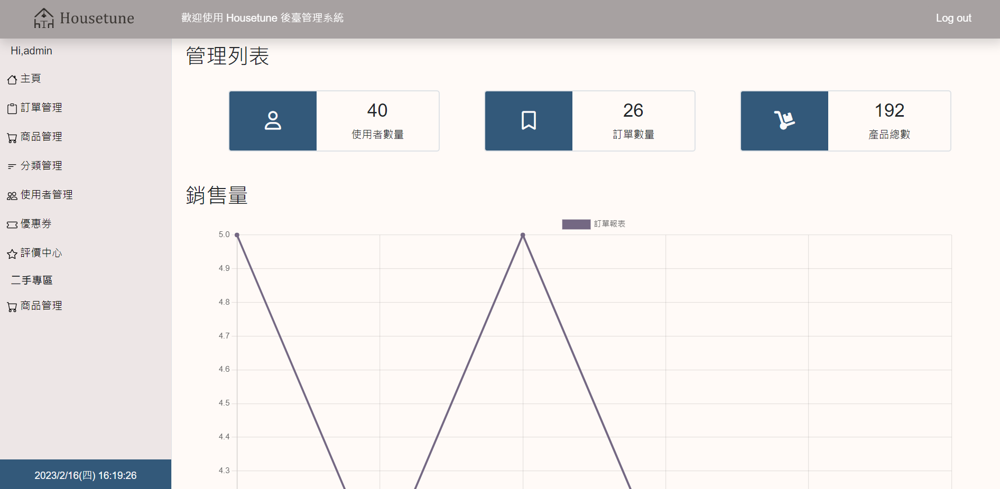

# Housetune 後台管理系統

## 專案概述

Housetune 為線上傢具電商網站，以優雅、簡約的商品為主，並提供二手專區讓會員上架或購買二手商品。

## 網頁預覽

 

## 網站功能
1. 使用者管理 : 新增會員、修改會員資料、Excel表單。
2. 評價中心 : 查閱商品評價。  
3. 商品管理 : 新增商品、修改商品資料、Excel表單。
4. 分類管理 : 新增分類、修改分類資料。
5. 訂單管理 : 查閱訂單、修改訂單備註。
7. 優惠券管理 : 新增優惠券、修改優惠券資料。


## 啟動方式

> 將檔案放至 C:\xampp\htdocs

> 使用瀏覽器，網址輸入 http://localhost/housetune-CMS/background-login.php

## 登入帳戶

### 使用以下帳戶即可開始測試

```
account : admin
password : 12345
```

## 專案使用技術

- PHP
- Bootstrap5
- Sass
- MySQL ( XAMPP )

### 聯絡作者

> _此專案為多人協作，若有運行上困難，可以聯絡專案小組。_

*gsn94561266@gmail.com*
